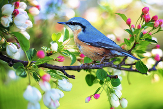
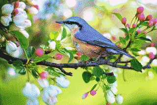
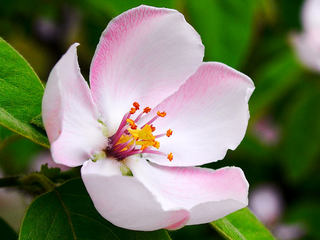
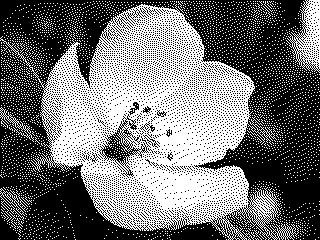
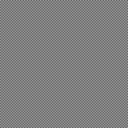

# Dither - Color Quantization and Dithering

This is a small program dedicated to reducing the number of colors in an
image. It operates with files in PNG or binary PPM format ([Portable
PixMap][ppm]), and features automatic palette generation (using a median-cut
algorithm) and dithering implemented with the Floyd-Steinberg method.

## Installing

#### On macOS with [Homebrew][brw]

    $ brew install tessarin/core/dither

#### Manual Installation

First, install [`libpng`][lpg]. Running `make` will then compile the program
and generate the documentation (requires Perl). To install, move the
executable and manual files to appropriate directories in your system.

    $ make
    $ mv dither ~/bin
    $ mv dither.1 ~/man/man1

Individual targets can also be specified to only compile the program or to
generate the manual page:

    $ make dither
    $ make doc

## Usage

    $ dither [-p name.size] [-dv] input output

Detailed information about the program options are included in the
[manual][man].

## Features

By default, `dither` will use a 3-bit RGB palette and dithering when
processing an image. Other possible palettes include:

 - Grayscale of any given size
 - Automatic, generated with the given size using a median-cut quantization
   algorithm
 - Custom palette

Dithering on the final image can be disabled and the program can also be used
just to generate a palette.

## Samples

#### Automatic Palette

    $ dither -p auto.32 bird-original.png bird-auto.32.png

#### 1-bit Black & White

    $ dither -p bw flower-original.png flower-bw.png

#### 50% Gray Test

Generates a perfect checkerboard pattern.

    $ dither -p bw gray-original.png gray-dithered.png

 [ppm]: https://en.wikipedia.org/wiki/Netpbm_format
 [brw]: https://brew.sh
 [lpg]: http://www.libpng.org/pub/png/libpng.html
 [man]: dither.pod
